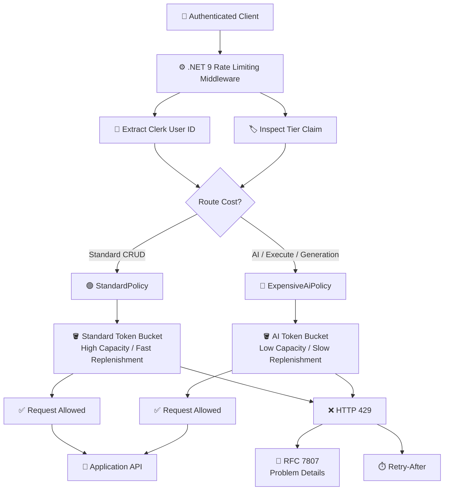
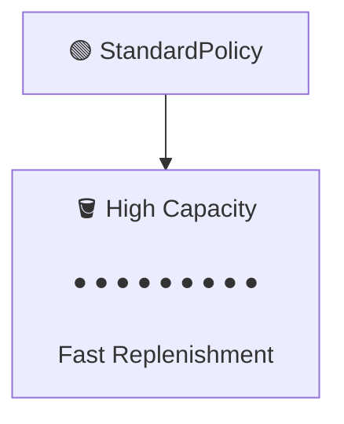
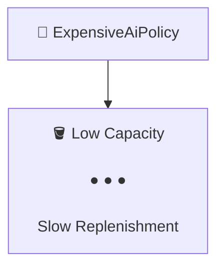
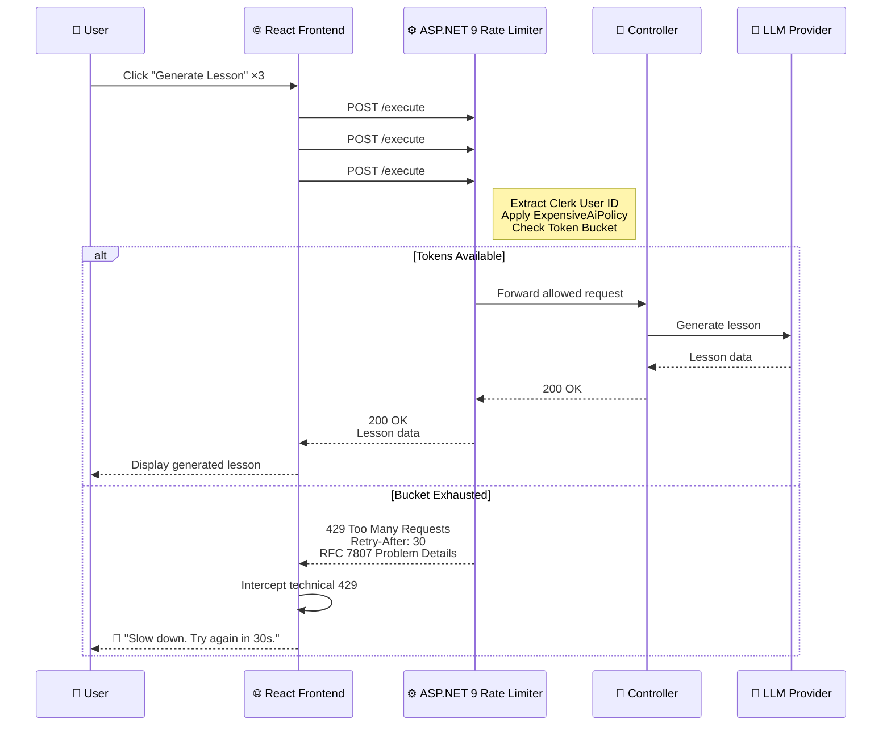
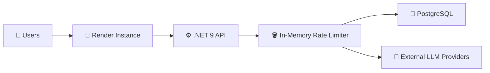
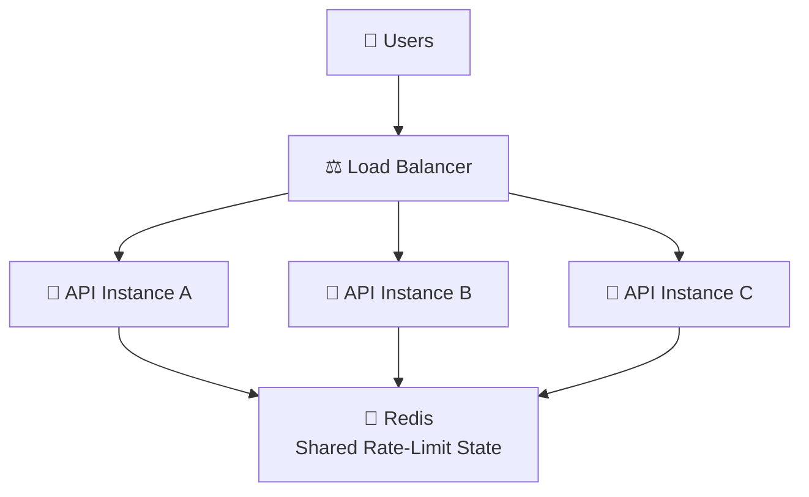
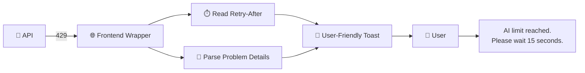
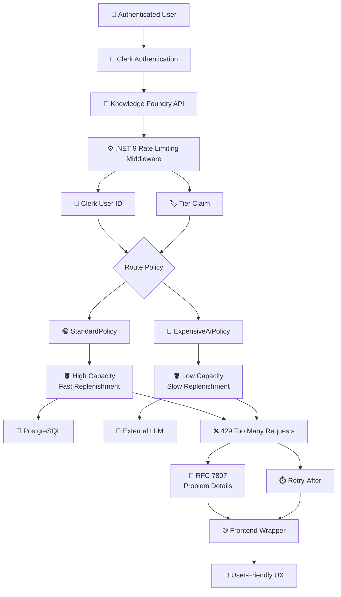

# ADR-007: Token-Bucket Rate Limiting for AI Orchestration

> **Status:** ✅ Accepted  
> **Date:** `2026-09-05`  
> **Authors:** **Knowledge Foundry Team**

---

## 📌 Context

Knowledge Foundry routes authenticated user requests to two fundamentally different types of resources:

- 🗄️ **Standard data stores**
  - PostgreSQL
  - Basic CRUD operations
  - Relatively inexpensive

- 🤖 **Expensive external services**
  - LLM providers
  - AI generation
  - `/execute` or `/generate` operations
  - Potentially high API costs

Without rate limiting, a malicious, buggy, or looping client could:

- Exhaust Render server resources
- Overload the backend
- Trigger excessive LLM requests
- Accumulate significant external API costs
- Degrade the experience for other users

### 🎯 Goal

We need a rate-limiting strategy that:

- Handles **burst traffic gracefully**
- Prevents **sustained abuse**
- Differentiates between **cheap and expensive operations**
- Identifies users through their **Clerk User ID**
- Works efficiently on a **single-instance Render deployment**
- Can be upgraded to a **distributed solution** later

The strategy is inspired by enterprise payment gateways such as **Stripe**, where traffic is segmented according to cost and burst capacity.

---

## 🧠 Decision

We will use the native **`.NET 9` `Microsoft.AspNetCore.RateLimiting` middleware** with a **Token Bucket** algorithm.

The rate limiter will:

1. Partition traffic based on **route cost**
2. Identify users using their **Clerk User ID**
3. Support future **Free / Premium tiering**
4. Allow controlled bursts
5. Gradually replenish available capacity
6. Fail immediately with **HTTP `429 Too Many Requests`**

---

## 🪣 Token Bucket Algorithm

Unlike a **Fixed Window** algorithm, which completely resets the request allowance at a specific interval, the Token Bucket algorithm maintains a bucket of available tokens.

Each request consumes tokens, while tokens are continuously replenished at a configured rate.

```text
                 Token Replenishment
                       ↓
              ┌─────────────────┐
              │   🪣 TOKEN      │
              │     BUCKET      │
              │                 │
              │ ● ● ● ● ● ●     │ ← Available tokens
              └────────┬────────┘
                       │
                       │ Request
                       ▼
                 ┌───────────┐
                 │    API    │
                 └─────┬─────┘
                       │
             ┌─────────┴─────────┐
             ▼                   ▼
        Token Available     No Tokens
             │                   │
             ▼                   ▼
         HTTP 200            HTTP 429
```

### Why Token Bucket?

| Property | Fixed Window | Token Bucket |
|---|---:|---:|
| Burst handling | ⚠️ Poor | ✅ Excellent |
| Smooth replenishment | ❌ No | ✅ Yes |
| Traffic spikes | ⚠️ Possible | ✅ Controlled |
| Sustained abuse | ✅ Limited | ✅ Limited |
| Suitable for AI endpoints | ⚠️ Less ideal | ✅ Yes |

The Token Bucket model allows legitimate users to perform a short burst of requests while still clamping down on sustained traffic.

---

## 🏗️ Rate-Limiting Architecture

The rate-limiting middleware sits in front of the application endpoints and determines whether a request can proceed based on the user's identity, tier, and route cost.



---

# 🔐 Partitioned Policies

Rate limits will be separated according to the **cost of the operation**.

---

## 🟢 `StandardPolicy`

Applied globally to basic CRUD endpoints.

### Typical Endpoints

```http
GET /api/prompt-templates
GET /api/prompt-templates/{id}
GET /api/context-packs
GET /api/context-packs/{id}
GET /api/lessons
GET /api/lessons
POST /api/context-packs
PUT /api/lessons/{id}/content
DELETE /api/lessons/{id}
```

### Characteristics

- **High capacity**
- **Fast replenishment**
- Designed for normal application traffic
- Suitable for frequent UI requests
- Protects PostgreSQL and Render resources

### 🟢 Standard Policy



### 🔴 Expensive AI Policy




---

## 🔴 `ExpensiveAiPolicy`

Applied strictly to expensive AI operations.

### Typical Endpoints

```http
POST /api/prompt-templates/{identifier}/execute
POST /api/lessons/generate
POST /api/ai-models
```

### Characteristics

- **Low capacity**
- **Slow replenishment**
- Designed to prevent LLM abuse
- Protects external API budgets
- Limits accidental request loops

```text
ExpensiveAiPolicy
       │
       ▼
┌─────────────────────┐
│ 🪣 Low Capacity     │
│                     │
│ ● ● ●               │
│                     │
│ Slow Replenishment  │
└─────────────────────┘
```

---

# 👤 Identity Keying & Tiering

Rate limits are partitioned using:

```csharp
ClaimTypes.NameIdentifier
```

This corresponds to the authenticated **Clerk User ID**.

### Identity Flow

```text
                    Incoming Request
                           │
                           ▼
                  ┌─────────────────┐
                  │ Clerk Auth      │
                  │ Claims          │
                  └────────┬────────┘
                           │
                           ▼
                  ┌─────────────────┐
                  │ NameIdentifier  │
                  │ = Clerk User ID │
                  └────────┬────────┘
                           │
                           ▼
                  ┌─────────────────┐
                  │ Tier Claim      │
                  │                 │
                  │ Free / Premium  │
                  └────────┬────────┘
                           │
                           ▼
                    Rate Limit Bucket
```

### 🏷️ Tier Support

A placeholder mechanism will inspect a `Tier` claim.

This allows future rate limits to be configured independently for:

- 🆓 **Free**
- 💎 **Premium**

For example:

```text
Free User
   │
   └──► Smaller Token Bucket

Premium User
   │
   └──► Larger Token Bucket
```

The exact capacities can be adjusted without changing the fundamental architecture.

---

# 🚨 Failure State — `429 Too Many Requests`

When a user's bucket is exhausted, the request will **fail immediately**.

The API will return:

```http
HTTP/1.1 429 Too Many Requests
Retry-After: 15
Content-Type: application/problem+json
```

The response body will use **RFC 7807 Problem Details**.

### Example

```json
{
  "type": "https://httpstatuses.com/429",
  "title": "Too Many Requests",
  "status": 429,
  "detail": "AI rate limit exceeded. Please try again later."
}
```

### Why `429`?

Using the standard HTTP status code gives the frontend a predictable contract.

---

# 🔄 AI Request Sequence

The following sequence illustrates a user triggering a burst of AI generation requests through the React frontend.



### 🧭 Flow Summary

1. **👤 User initiates an AI request**
   - User clicks **Generate Lesson**.
   - Multiple rapid clicks create a burst of requests.

2. **🌐 Frontend forwards the request**
   - React sends `POST /execute`.
   - The request includes the authenticated **Clerk JWT**.

3. **⚙️ Rate limiter evaluates the request**
   - ASP.NET 9 rate-limiting middleware extracts the user's identity.
   - The request is associated with the user's **Token Bucket**.
   - `ExpensiveAiPolicy` is applied.

4. **🪣 Tokens are available**
   - The request passes through the middleware.
   - The controller executes the AI operation.
   - The LLM provider generates the result.
   - The frontend receives `200 OK`.

5. **🚫 Bucket is exhausted**
   - The middleware rejects the request immediately.
   - The API returns:
     - `429 Too Many Requests`
     - `Retry-After`
     - RFC 7807 **Problem Details**

6. **🔔 Frontend handles the rejection**
   - The React wrapper intercepts the technical `429`.
   - The user sees a friendly message:

   > **"Slow down. Try again in 30s."**

---

# 🏎️ Fail Fast vs. Queuing

We considered two approaches.

## Option A — Queue Requests

```text
Request
   │
   ▼
No token
   │
   ▼
⏳ Queue
   │
   ▼
Wait for token
   │
   ▼
Execute request
```

## Option B — Fail Fast ✅

```text
Request
   │
   ▼
No token
   │
   ▼
❌ HTTP 429
   │
   ▼
Client retries later
```

We chose **fail fast**.

### Rationale

Queuing overloaded requests could:

- Consume server memory
- Hold connections open
- Increase thread/resource usage
- Create a backlog during abuse
- Further overload the Render container

Failing immediately keeps the server responsive and prevents resource exhaustion.

---

# 💾 In-Memory vs. Redis

## Current Architecture: In-Memory

Because Knowledge Foundry is optimized for a **single-instance Render free-tier deployment**, we will use the **in-memory rate-limiting provider**.



### Advantages

- ✅ No additional infrastructure
- ✅ Simple deployment
- ✅ Low latency
- ✅ No Redis cost
- ✅ Appropriate for a single instance

### Trade-off

The rate-limit state exists **only inside the running application instance**.

If the application restarts, the in-memory buckets are reset.

---

# 🌐 Future Architecture — Horizontal Scaling

If Knowledge Foundry eventually deploys multiple backend instances:



Without a shared store, each instance would maintain an independent bucket:

```text
User A
  │
  ├──► Server A → 10 tokens
  │
  ├──► Server B → 10 tokens
  │
  └──► Server C → 10 tokens
```

This would effectively multiply the user's available rate limit.

With Redis:

```text
                    ┌─────────────────────┐
Server A ──────────►│                     │
Server B ──────────►│       🔴 Redis      │
Server C ──────────►│                     │
                    │ Shared Token State  │
                    └─────────────────────┘
```

Redis therefore becomes necessary when **horizontal scaling** is introduced.

The current in-memory implementation is intentionally accepted as a trade-off for the single-instance deployment model.

---

# 🔄 Migration Path

The `.NET 9` rate-limiting abstraction keeps the implementation decoupled from the underlying storage strategy.

### Current

```text
.NET 9
  │
  ▼
In-Memory Provider
  │
  ▼
Single Render Instance
```

### Future

```text
.NET 9
  │
  ▼
Distributed Provider
  │
  ▼
Redis
  │
  ▼
Multiple API Instances
```

This means the current architecture does **not** need to be redesigned when horizontal scaling becomes necessary.

---

# 🖥️ Client-Side UX Integration

The frontend wrapper will treat `429` as a known, recoverable condition rather than an application failure.



Instead of exposing a raw technical error:

```http
HTTP 429 Too Many Requests
```

the UI can display:

> ⚠️ **AI limit reached. Please wait 15 seconds.**

This provides a clean separation between:

- **Backend:** standardized HTTP error contract
- **Frontend:** user-friendly presentation

---

# ⚖️ Technical Trade-offs

| Decision | Choice | Reason |
|---|---|---|
| Algorithm | **Token Bucket** | Handles bursts while limiting sustained traffic |
| Standard endpoints | **High-capacity bucket** | CRUD operations are relatively inexpensive |
| AI endpoints | **Low-capacity bucket** | LLM operations are expensive |
| Identity | **Clerk User ID** | Per-user isolation |
| Tiering | **`Tier` claim** | Future Free/Premium support |
| Storage | **In-Memory** | Appropriate for single-instance deployment |
| Distributed state | **Redis later** | Required for horizontal scaling |
| Overload behavior | **Fail Fast** | Prevents thread/resource exhaustion |
| HTTP response | **`429 Too Many Requests`** | Standard and machine-readable |
| Error format | **RFC 7807 Problem Details** | Consistent API error contract |
| Retry guidance | **`Retry-After`** | Enables intelligent client behavior |

---

# 🗺️ Final Architecture

The complete request and rate-limiting architecture is summarized below.



---

## ✅ Decision Summary

Knowledge Foundry will use **Token-Bucket rate limiting through `.NET 9 Microsoft.AspNetCore.RateLimiting`**, with limits partitioned by **operation cost** and **Clerk User ID**.

The architecture intentionally prioritizes:

- 🛡️ **Protection against abuse**
- 💰 **LLM cost control**
- 🚀 **Graceful burst handling**
- ⚡ **Fail-fast overload protection**
- 👤 **Per-user rate limiting**
- 🏷️ **Future Free/Premium tier support**
- 💾 **Zero additional infrastructure on Render free tier**
- 🔄 **A clear migration path to Redis and horizontal scaling**

> **Accepted trade-off:** In-memory state is appropriate for the current single-instance deployment. If Knowledge Foundry scales horizontally, rate-limit state will move to a distributed store such as **Redis**.

---

## 📁 Document Location

Recommended repository structure:

```text
docs/
└── adr/
    └── ADR-007-token-bucket-rate-limiting-for-AI-orchestration.md
```
