# ADR-008: Multi-Agent Reflection Loop for AI Generation

> **Status:** ✅ Accepted  
> **Date:** `2026-09-12`  
> **Authors:** **Knowledge Foundry Team**

---

## 📌 Context

Knowledge Foundry utilizes external LLMs (e.g., Groq, Gemini) to generate educational lessons based on user prompts and dynamic Context Packs. 

Currently, generation is a **single-shot pipeline**: the system sends a prompt and accepts the first response as the final `LessonContent`. Single-shot generation is prone to:
- Hallucinations or straying from the provided Context Pack.
- Structural inconsistencies (e.g., ignoring formatting instructions).
- Missing critical concepts requested by the user.

Since our domain model already supports `CriticPromptTemplateId`, `CritiqueNotes`, and discrete generation statuses (`Drafting`, `Critiquing`, `Refining`), the system is structurally prepared for an autonomous self-correction mechanism.

### 🎯 Goal

Implement a **Formative Evaluation (Reflection) Loop** where multiple AI agents collaborate to produce high-quality output before it is presented to the user, without blocking the main HTTP request thread.

---

## 🧠 Decision

We will implement an **asynchronous**, multi-agent reflection loop orchestrated by a .NET 9 `BackgroundService` (`LessonGenerationWorker`). 

When a user selects a `CriticPromptTemplateId` during lesson creation, the MediatR command handler will queue the generation job and instantly return the Lesson ID. The background worker will then autonomously execute a three-step LLM pipeline:

1. **Draft (Generator Agent):** The primary model generates an initial lesson draft.
2. **Critique (Critic Agent):** The draft is passed to a secondary evaluator model using the Critic Prompt Template. The critic analyzes the draft against the original context and outputs structured feedback (`CritiqueNotes`).
3. **Refine (Generator Agent):** The primary model receives its original draft alongside the `CritiqueNotes` and is instructed to rewrite and fix the identified flaws.

---

## 🏗️ Architecture & State Machine Flow

The orchestration logic maps directly to the existing `Lesson.cs` domain entity state machine, executed entirely in the background.

```mermaid
sequenceDiagram
    participant UI as 🌐 React UI
    participant API as 🚀 MediatR Handler
    participant DB as 🐘 PostgreSQL
    participant Worker as ⚙️ Background Worker
    participant Gen as 🤖 Generator LLM
    participant Critic as 🧐 Critic LLM

    UI->>API: POST /generate (CriticTemplateId)
    API->>DB: Lesson.CreatePending()
    API->>Worker: Enqueue LessonGenerationJob
    API-->>UI: 202 Accepted (Lesson ID)
    
    rect rgb(24, 24, 27)
        Note right of Worker: 1. DRAFTING PHASE
        Worker->>Gen: Execute Primary Prompt + Context
        Gen-->>Worker: Draft Content
    end
    
    alt CriticTemplateId Exists
        rect rgb(24, 24, 27)
            Note right of Worker: 2. CRITIQUING PHASE
            Worker->>DB: Lesson.TransitionToCritiquing()
            Worker->>Critic: Execute Critic Prompt + Draft Content
            Critic-->>Worker: Critique Notes (Feedback)
        end
        
        rect rgb(24, 24, 27)
            Note right of Worker: 3. REFINING PHASE
            Worker->>DB: Lesson.TransitionToRefining(notes)
            Worker->>Gen: Execute Primary Prompt + Notes + Draft
            Gen-->>Worker: Final Polished Content
        end
    end
    
    Worker->>DB: Lesson.MarkAsCompleted(Final Content)
```

## ⚖️ Technical Trade-offs

| Decision | Consequence | Justification |
| :--- | :--- | :--- |
| **Asynchronous Processing** | The UI must poll the backend to retrieve the final lesson or status updates. | A multi-agent loop easily exceeds standard 30-second HTTP timeout limits. Background processing prevents browser timeouts and keeps the web threads free. |
| **Multiple LLM Calls** | Token usage and API costs will increase significantly per lesson. | High-quality educational content requires rigorous validation. The Token Bucket rate limiter (ADR-007) is already in place to prevent cost overruns. |
| **In-Memory State** | The orchestration holds the Draft and Critique strings in memory during the request. | Keeps the `Lessons` database table clean by only persisting the final content and the meta-notes, rather than storing intermediate garbage drafts. |
| **Prompt vs. Model Routing** | Both Generator and Critic roles currently use the same underlying provider/model, differing only in the Prompt Template used. | Simplifies initial implementation. Future iterations can route Critic tasks to more capable (but slower/expensive) models like GPT-4o or Gemini 1.5 Pro. |

---

## 🖥️ UX/UI Impact

The React frontend handles the asynchronous nature by polling the `GetLessonById` endpoint, displaying dynamic loading states (`Drafting...`, `Critique in progress...`, `Refining...`) based on the Lesson's status.

Once complete, the `CritiqueNotes` are displayed in an expandable "AI Reflection & Critic Notes" accordion below the finished lesson. This exposes the multi-agent collaboration to the user, establishing high trust and showcasing the platform's advanced orchestration capabilities.