# ADR-009: Automated Evaluation Engine via Structured LLM Output

> **Status:** ✅ Accepted  
> **Date:** `2026-09-12`  
> **Authors:** **Knowledge Foundry Team**

---

## 📌 Context

Knowledge Foundry can generate highly refined educational content using the Multi-Agent Reflection Loop. However, there is no quantifiable way to measure the quality, factual accuracy, or readability of the final output. 

We need an observability mechanism to grade generated lessons, allowing users (and administrators) to track AI performance over time across different providers and models.

### 🎯 Goal

Implement a **Summative Evaluation Engine** that uses an LLM as an impartial judge to score a completed lesson against a defined rubric and return a structured JSON scorecard.

---

## 🧠 Decision

We will build the Evaluation Engine with the following constraints:

1. **Manual Trigger:** Evaluations will be triggered manually via a UI action to conserve free-tier API limits and demonstrate deliberate execution.
2. **Template-Driven Rubrics:** We will expand the `PromptPurpose` enum to include `Evaluation`. Users will author evaluation rubrics just like standard prompts, specifying the exact JSON schema the AI must return.
3. **Robust JSON Parsing:** Because cross-provider (OpenRouter/Groq/Gemini) support for strict JSON modes varies, we will rely on prompt engineering to request JSON and implement a C# sanitization pipeline to clean Markdown artifacts before deserialization.
4. **Domain Isolation:** The `LessonEvaluation` will be modeled as a distinct Entity/Value Object attached to the `Lesson` aggregate, persisting numerical scores, textual feedback, and execution telemetry.

---

## 🏗️ Architecture Flow

```mermaid
sequenceDiagram
    participant UI as 🌐 React UI
    participant API as 🚀 MediatR Handler
    participant DB as 🐘 PostgreSQL
    participant AI as 🤖 Evaluator LLM

    UI->>API: POST /api/lessons/{id}/evaluate (TemplateId)
    API->>DB: Fetch Completed Lesson & Eval Template
    
    rect rgb(24, 24, 27)
        Note right of API: EVALUATION PHASE
        API->>AI: Execute Prompt: Rubric + Lesson Content
        AI-->>API: Raw String (Hopefully JSON)
        API->>API: Sanitize & Deserialize JSON
    end
    
    API->>DB: Save LessonEvaluation Entity
    API-->>UI: 200 OK (Scorecard Data)
```

---

## ⚖️ Technical Trade-offs

| Decision | Consequence | Justification |
| :--- | :--- | :--- |
| **Manual vs. Auto-trigger** | Requires an extra user click. | Protects free-tier rate limits (ADR-007) and provides a better interactive demo for portfolio showcases. |
| **Prompt-Engineered JSON** | The LLM might occasionally return malformed JSON, causing deserialization failures. | Necessary to support a wide variety of free OpenRouter models that do not support native JSON schema enforcement. |
| **Template-based Rubrics** | The UI must pass the desired Evaluation Template ID when triggering the grade. | Maximizes reusability. Allows different subjects to be graded on completely different criteria without changing backend code. |
