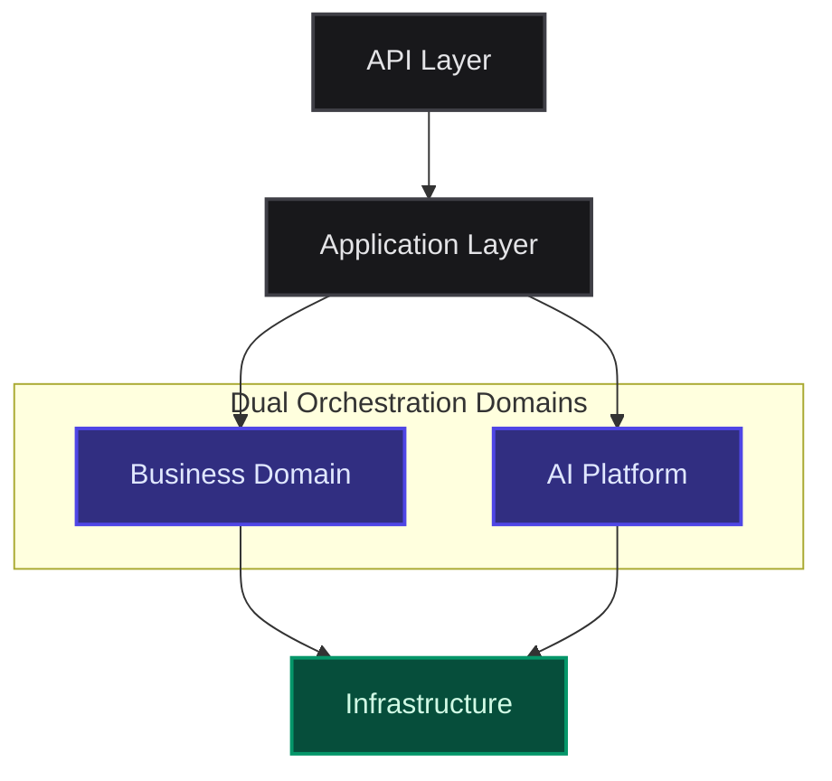

## Domain Responsibilities

| Architectural Layer         | Responsibilities                                                                                                                                                       |
| --------------------------- | ---------------------------------------------------------------------------------------------------------------------------------------------------------------------- |
| **API & Application Layer** | Ingests requests and delegates them to the appropriate underlying orchestration domain.                                                                                |
| **Business Domain**         | Executes product workflows, authentication, authorization, user management, and core lesson generation requests.                                                       |
| **AI Platform**             | Manages cognitive workflows, including prompt orchestration, context injection, provider routing, structured output validation, reflection loops, and experimentation. |
| **Infrastructure**          | Provides raw execution capabilities for both domains without housing any business or AI decision-making logic.                                                         |

